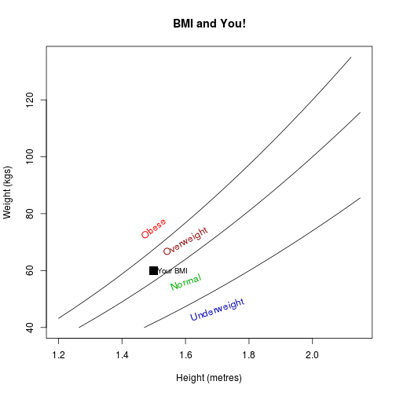

BMI and You!
========================================================
author: Shashishekhar S
date: 19/Mar/2015

BMI?
========================================================

Body mass index (BMI) is a measure of body fat based on height and weight that applies to adult men and women.

BMI Categories: 

 - Underweight = <18.5
 - Normal weight = 18.5–24.9 
 - Overweight = 25–29.9 
 - Obesity = BMI of 30 or greater

This app helps you know your BMI. It also indicates if you are Underweight, Overweight, Obese or Normal.

Your BMI in numbers ...
========================================================

Your results:

weight:
 [1] 75

height:
 [1] 1.7

Your BMI is:
 [1] 25.95156

It means that you are:
 [1] "overweight"

Your BMI in a plot ...
========================================================

 

Thank you!
========================================================

Check your BMI
Go to https://courser-ddp.shinyapps.io/bmiapp/
